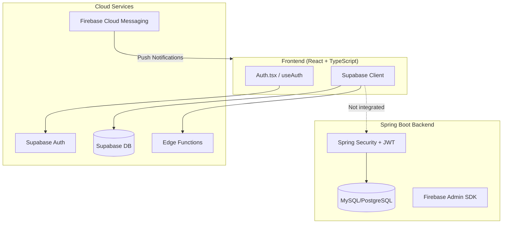
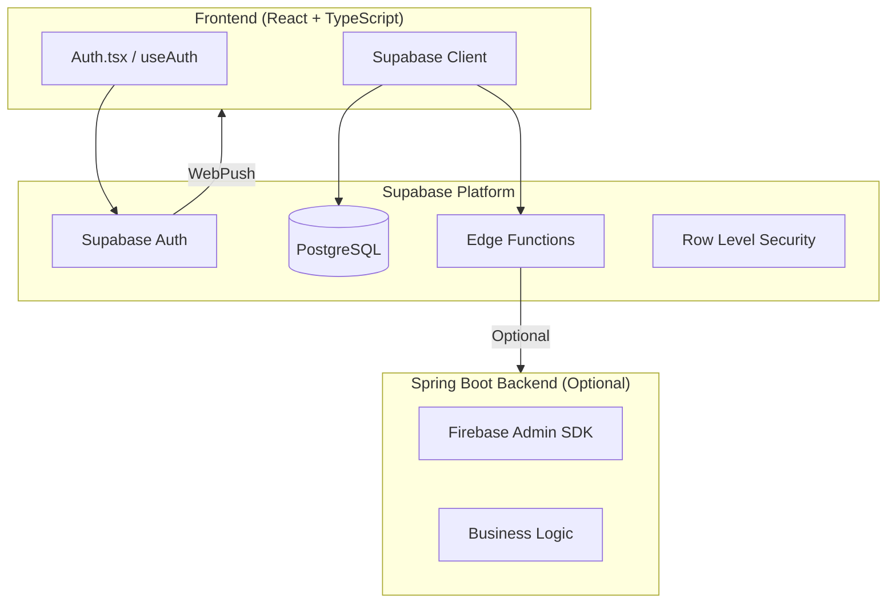

# VetConnect System Design Document

## Executive Summary

This document outlines the architectural issues found in the HealthyTom VetConnect application and provides a system design to fix the dual authentication mismatch between the Spring Boot backend and Supabase.

---

## Current Architecture Analysis

### Problem Statement

The application has **dual authentication systems** that are not properly integrated:

1. **Frontend + Supabase**: Uses Supabase Auth for user authentication
2. **Spring Boot Backend**: Uses Spring Security with JWT tokens (local database)

This creates a fundamental conflict where:
- Users authenticate with Supabase but backend can't recognize them
- Role systems are inconsistent between systems
- The backend is essentially unused for primary operations

### Current System Diagram



---

## Identified Errors

### Error 1: Role System Mismatch

**Location**: 
- Frontend: [`src/hooks/useAuth.tsx`](src/hooks/useAuth.tsx:5) - defines roles as `farmer`, `vet`, `admin`
- Backend: [`backend/src/main/java/com/healthytom/entity/User.java`](backend/src/main/java/com/healthytom/entity/User.java:60) - defines roles as `OWNER`, `VETERINARIAN`, `ADMIN`
- Supabase: [`src/integrations/supabase/types.ts`](src/integrations/supabase/types.ts:358) - defines enum as `farmer`, `vet`, `admin`

**Impact**: No consistent role definition across the stack.

### Error 2: Unused Backend Authentication

**Location**: 
- [`backend/src/main/java/com/healthytom/config/SecurityConfig.java`](backend/src/main/java/com/healthytom/config/SecurityConfig.java:64-67)
- [`backend/src/main/java/com/healthytom/service/AuthService.java`](backend/src/main/java/com/healthytom/service/AuthService.java)

**Issue**: Backend has complete auth system but frontend uses Supabase exclusively. The `/api/auth/**` endpoints are never called.

### Error 3: Admin API Redundant Operations

**Location**: [`supabase/functions/admin-api/index.ts`](supabase/functions/admin-api/index.ts:79-88)

```typescript
// Redundant upsert followed by delete/insert
const { error } = await adminClient
  .from('user_roles')
  .upsert({ user_id: target_user_id, role: new_role }, { onConflict: 'user_id,role' });

// If changing role, delete old role first then insert new
await adminClient.from('user_roles').delete().eq('user_id', target_user_id);
const { error: insertError } = await adminClient.from('user_roles').insert({ user_id: target_user_id, role: new_role });
```

This creates unnecessary database operations and potential race conditions.

### Error 4: Missing Profile Creation on Signup

**Location**: [`src/hooks/useAuth.tsx`](src/hooks/useAuth.tsx:60-78)

When a user signs up via Supabase, the profile is not automatically created in the `profiles` table.

---

## System Design Recommendations

### Option A: Full Supabase Integration (Recommended)

This option removes the Spring Boot backend authentication and uses Supabase as the sole authentication provider.



**Implementation Steps**:

1. **Unify Role Definition**
   - Keep roles in Supabase (`farmer`, `vet`, `admin`)
   - Remove or refactor backend User entity roles

2. **Enable RLS Policies**
   - Add Row Level Security policies for all tables
   - Define role-based access rules

3. **Migrate Edge Functions**
   - Use Supabase Edge Functions for API endpoints
   - Implement proper auth verification

4. **Remove Backend Auth Dependencies**
   - Keep Spring Boot only for business logic if needed
   - Use service role key for backend-supabase communication

### Option B: Hybrid Integration

Keep both systems but properly integrate them using Supabase as the primary auth.

```mermaid
flowchart TB
    subgraph Client["Frontend"]
        Auth[Auth.tsx]
    end
    
    subgraph Supabase["Supabase (Primary Auth)"]
        SupabaseAuth[Supabase Auth]
    end
    
    subgraph Backend["Spring Boot Backend"]
        JWTValidator[JWT Validation]
        SupabaseClient[Supabase Client - Service Role]
        BusinessLogic[Business Logic]
    end
    
    Auth --> SupabaseAuth
    Client -->|JWT Token| JWTValidator
    JWTValidator --> SupabaseAuth|Verify Token|
    SupabaseClient -->|Query Roles| SupabaseAuth
```

**Implementation Steps**:

1. Use Supabase JWT for backend authentication
2. Validate Supabase tokens in Spring Boot
3. Query user roles from Supabase instead of local DB
4. Configure CORS properly for both origins

---

## Recommended Solution: Option A (Full Supabase)

### Architecture Benefits

| Aspect | Current | Proposed |
|-------|---------|----------|
| Auth Providers | 2 (conflicting) | 1 (Supabase) |
| Role Management | 3 different systems | 1 (Supabase) |
| Database | Dual (MySQL + PostgreSQL) | Single (PostgreSQL) |
| API Complexity | High | Low |
| Deployment | Complex | Simple |

### Implementation Plan

#### Phase 1: Stabilize Current System

1. **Fix Admin API** - Remove redundant operations in `admin-api/index.ts`
2. **Add Profile Triggers** - Create database trigger for automatic profile creation
3. **Enable RLS** - Secure all tables with Row Level Security

#### Phase 2: Migrate to Supabase

1. **Consolidate Roles** - Use Supabase as single source of truth
2. **Move API Logic** - Migrate business logic to Edge Functions
3. **Remove Backend Auth** - Keep Spring Boot for Firebase features only

#### Phase 3: Optimize

1. **Add Real-time Features** - Use Supabase Realtime for chat/notifications
2. **Optimize Queries** - Use Supabase caching and connection pooling
3. **Monitor & Scale** - Set up proper monitoring

---

## Specific Fixes Required

### Fix 1: Admin API (Lines 79-88)

Replace the redundant upsert/delete/insert with a single upsert:

```typescript
// Replace lines 79-88 with:
const { error } = await adminClient
  .from('user_roles')
  .upsert({ 
    user_id: target_user_id, 
    role: new_role 
  }, { 
    onConflict: 'user_id' 
  });

if (error) throw error;
```

### Fix 2: Add Profile Creation Trigger

Create a database trigger in Supabase:

```sql
CREATE OR REPLACE FUNCTION public.handle_new_user()
RETURNS TRIGGER AS $$
BEGIN
  INSERT INTO public.profiles (user_id, full_name, created_at, updated_at)
  VALUES (
    NEW.id,
    NEW.raw_user_meta_data->>'full_name',
    NOW(),
    NOW()
  );
  RETURN NEW;
END;
$$ LANGUAGE plpgsql SECURITY DEFINER;

CREATE TRIGGER on_auth_user_created
  AFTER INSERT ON auth.users
  FOR EACH ROW EXECUTE FUNCTION public.handle_new_user();
```

### Fix 3: Enable Row Level Security

Add RLS policies for all tables:

```sql
-- Example: Pets table
ALTER TABLE public.pets ENABLE ROW LEVEL SECURITY;

CREATE POLICY "Users can view own pets"
  ON public.pets FOR SELECT
  USING (auth.uid() = owner_id);

CREATE POLICY "Users can insert own pets"
  ON public.pets FOR INSERT
  WITH CHECK (auth.uid() = owner_id);
```

---

## Conclusion

The primary error in this application is the **dual authentication mismatch** between Spring Boot JWT and Supabase Auth. The recommended solution is to:

1. **Use Supabase as the single authentication provider**
2. **Remove or refactor the Spring Boot auth system**
3. **Fix the Admin API redundant operations**
4. **Add automatic profile creation via database triggers**
5. **Implement Row Level Security for data protection**

This will simplify the architecture, reduce maintenance overhead, and leverage Supabase's built-in features effectively.
